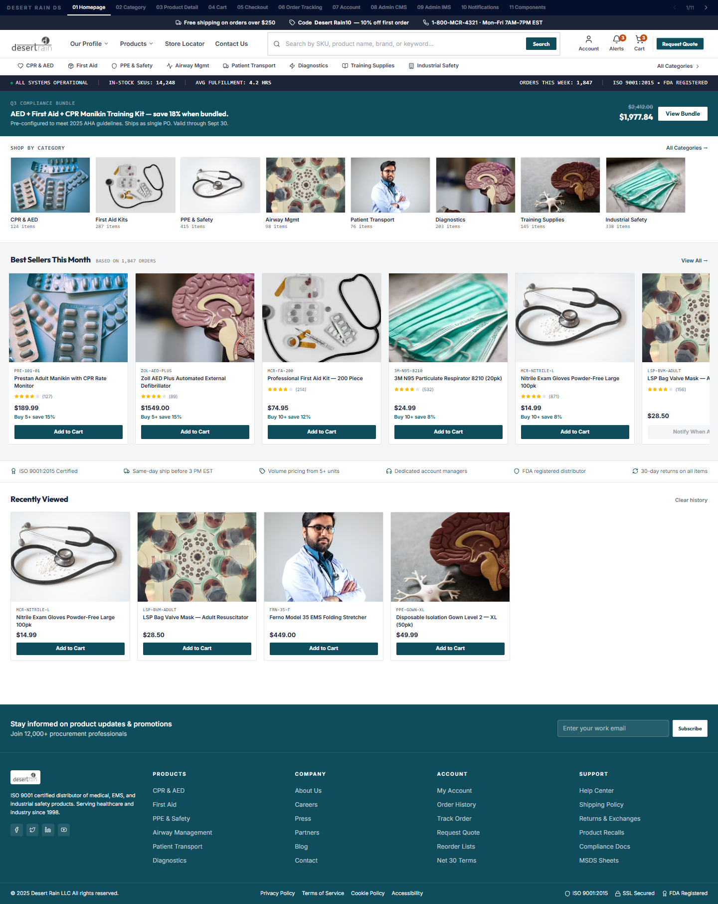
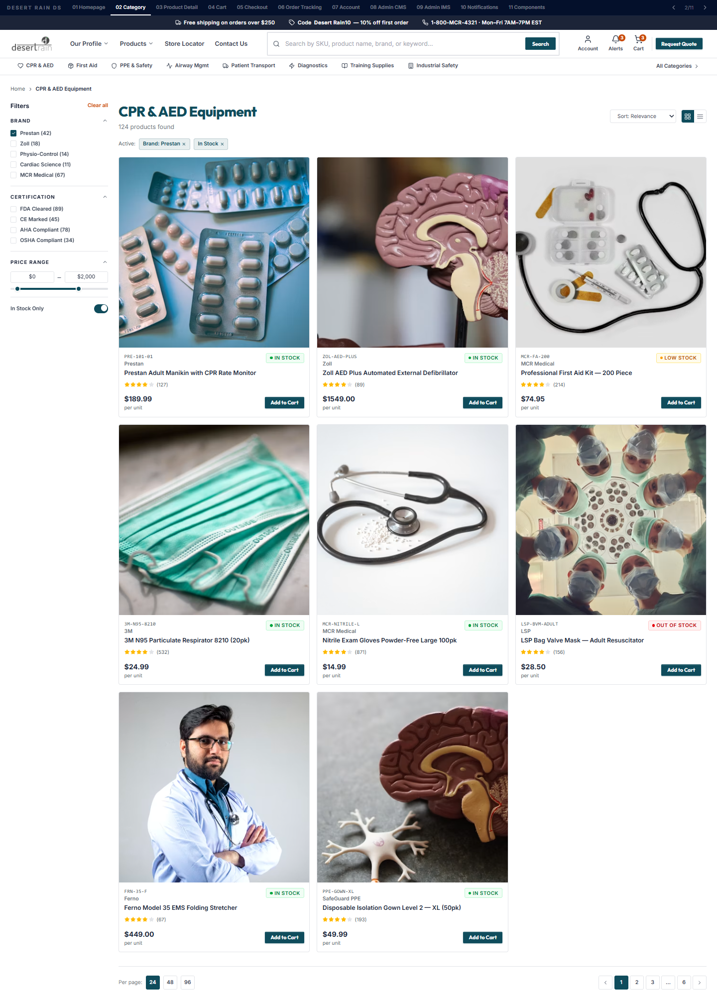
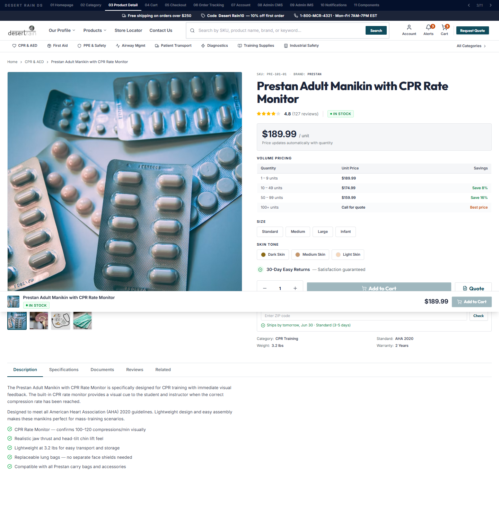
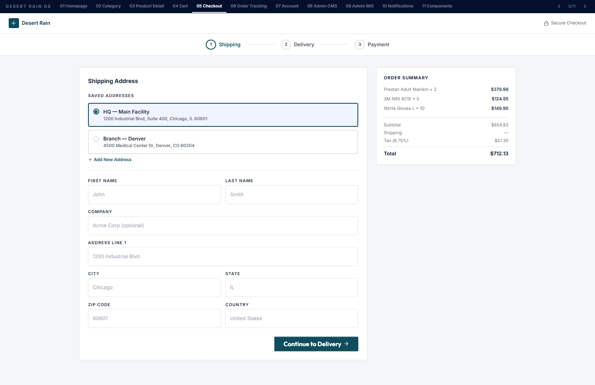

# Desert Rain Supply - B2B Ecommerce Platform

A specialized B2B ecommerce platform built with React, Vite, and Tailwind CSS. Designed specifically for industrial procurement and medical supply, avoiding generic SaaS aesthetics in favor of a dense, data-first "Grainger/McMaster-Carr" style layout.

## Screenshots

### Homepage

### Category Catalog

### Product Detail

### Checkout Flow

## Technology Stack
- **Framework:** React + Vite
- **Styling:** Tailwind CSS
- **Components:** Shadcn UI base, heavily customized for B2B usage
- **Icons:** Lucide React

## Design Principles
- **No Consumer Marketing:** No neon discount badges, rotating carousels, or artificial urgency tactics ("Only 2 left!").
- **Data-Dense Layout:** Quick reorder inputs, table-based product lists, monospaced SKUs.
- **Bulk Purchasing Logic:** Transparent volume tier pricing directly on product cards (e.g., "Buy 10+ save 15%").
- **Trust-First Headers:** Live operational status ticker (ISO 9001, FDA Registered, average fulfillment times).
